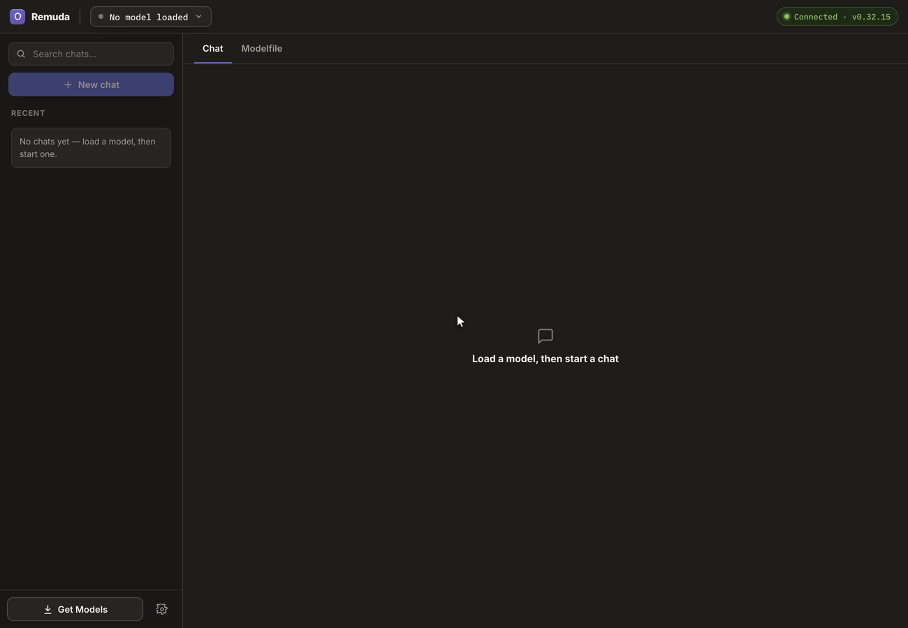

<div align="center">
  
  <h1>Remuda</h1>
  <p><strong>A desktop app for running, testing and tuning your local Ollama models.</strong></p>
  <p>
    <a href="https://github.com/magna-nz/remuda/actions/workflows/ci.yml"></a>
    <a href="https://github.com/magna-nz/remuda/releases/latest"></a>
    <a href="https://github.com/magna-nz/remuda/releases"></a>
    
    <!-- PLACEHOLDER: swap for a real license badge once a LICENSE is chosen -->
    
  </p>
  <p>
    <a href="#install">Install</a> ·
    <a href="#quick-start">Quick start</a> ·
    <a href="#what-you-get">Features</a> ·
    <a href="SPEC.md">Spec</a>
  </p>
</div>

<br />

<div align="center">
  
  <br />
  <sub><strong>Chats on the left, the loaded model in the top bar, the Modelfile one click away.</strong></sub>
</div>

<br />

## Why

Ollama is a good runtime with a terminal-shaped workflow. Running a model well means bouncing
between `ollama list`, `ollama run`, `ollama show`, and a Modelfile in another editor.

Remuda puts that in one window. Pick a model, load it, chat to test it, and open its Modelfile
next to the chat when the answers aren't right. Save, and Remuda rebuilds the model through
Ollama and reloads it, so your next message uses the change.

Nothing leaves your machine. Remuda is a client for the Ollama you already run on `127.0.0.1`.

> A *remuda* is the herd of horses a ranch hand picks their mount from each day. Your models are
> the herd, one is saddled at a time, and swapping should take seconds.

## What you get

| | |
| --- | --- |
| **Load pane** | Every installed model, with tuned variants grouped under their base. Pick a Modelfile, hit Load, watch real progress. **Eject** hands the memory back without waiting out `keep_alive`. |
| **Chat** | Saved sessions that remember the model they ran on, and offer to load it again rather than silently swapping. Streaming replies, cancel, and a warming indicator. |
| **Reasoning and vision** | Thinking is folded into its own collapsed block above the answer, and never sent back as context. Vision models get a paperclip. Embedding models say up front that they can't chat. |
| **Per-chat parameters** | Temperature, top-p, top-k, seed and the rest, overridden for the current chat only. No `ollama create`, no reload. **Bake into Modelfile** when a setting earns its place. |
| **Memory readout** | The VRAM/RAM split, the context the runner started with, and a live `keep_alive` countdown. A `100% GPU` chip in the top bar turns amber the moment the model spills into system RAM. |
| **Modelfile editor** | A form for the common fields, synced both ways with the raw text, which stays the source of truth. `LICENSE`, `ADAPTER`, `MESSAGE` and comments round-trip byte for byte. |
| **Save as…** | Fork a tuned variant, optionally quantising it on the way in. Remuda runs `ollama create`, stops the old model and loads the new one. |
| **Pull** | Per-layer progress, cancel and retry, plus a curated list of popular models with the installed ones marked. |
| **Per-reply stats** | Generation tok/s, prompt-eval tok/s, load time, total time, and context used. |

## Requirements

* [Ollama](https://ollama.com) running locally. Remuda is a client, so it doesn't bundle models
  or run inference itself.
* macOS 12+ on Apple Silicon. <!-- PLACEHOLDER: Intel/universal + Linux/Windows builds are planned -->

```sh
brew install ollama
ollama serve
```

## Install

```sh
brew install --cask magna-nz/tap/remuda
```

That pulls in [magna-nz/homebrew-tap](https://github.com/magna-nz/homebrew-tap) on the way through,
so there's no separate `brew tap` step.

The build is unsigned — no Apple Developer program — so macOS would normally quarantine it and
refuse to open it. The cask clears that flag as part of the install, so the app just launches.

Afterwards:

```sh
brew upgrade --cask remuda     # move to the latest release
brew uninstall --cask remuda   # remove it
```

<sub>If macOS ever balks anyway, run
<code>xattr -dr com.apple.quarantine /Applications/Remuda.app</code>. See
<a href="packaging/homebrew/README.md">packaging/homebrew</a> for release and tap mechanics.</sub>

Or from source:

```sh
git clone https://github.com/magna-nz/remuda.git
cd remuda/app && npm install
cd ../src-tauri && cargo tauri dev
```

## Quick start

1. Start Ollama with `ollama serve`. Remuda's connection pill goes green.
2. Click the model control in the top bar, pick a model, hit **Load**.
3. Hit **＋ New chat** and say hello.
4. Not the behaviour you wanted? Click the pencil, edit the system prompt, **Save**. The model
   reloads and your next message uses it.
5. Happy with it? **Save as…** keeps it as a named variant with the original left alone.

No models installed yet? The load pane offers **Pull your first model**.

## Look and feel

Dark only. A warm neutral ground with an indigo to violet brand, set in **Inter**, with **IBM Plex
Mono** for anything machine-facing: model tags, Modelfiles, parameters, the token stream.

## Documentation

* [`SPEC.md`](SPEC.md) is the full product spec: every surface, the Ollama calls behind it, the
  Modelfile sync contract, and the open questions.
* [`docs/mockup.html`](docs/mockup.html) is the interactive design mockup the app is built to.
* [`packaging/homebrew/`](packaging/homebrew/README.md) covers release and tap mechanics.

## Contributing

You'll need [Node](https://nodejs.org) 22+ and a [Rust](https://rustup.rs) toolchain.

```sh
cd app
npm run typecheck   # tsc --noEmit
npm test            # vitest
npm run build       # tsc && vite build
```

For the desktop shell, run `cargo check` or `cargo tauri dev` from `src-tauri/`.

CI runs both sets of gates on every pull request and on pushes to `main`, plus `cargo fmt
--check` and `cargo clippy -D warnings`.

The release workflow builds the macOS app on a `v*` tag, publishes it as a GitHub release, and
pushes the rendered Homebrew cask to the tap. It refuses to build if the tag disagrees with the
version in any of `tauri.conf.json`, `Cargo.toml`, `Cargo.lock`, `package.json` or
`package-lock.json` — bump all five in one commit before tagging. See
[`packaging/homebrew/`](packaging/homebrew/README.md) for the full release flow.

## License

<!-- PLACEHOLDER: choose a license (currently all rights reserved by default) -->
TBD. No license chosen yet, so all rights reserved until one is added.
