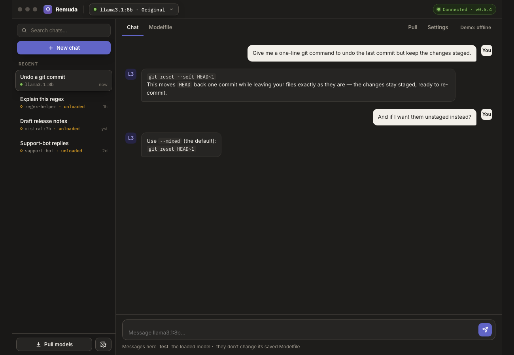

<div align="center">
  
  <h1>Remuda</h1>
  <p><strong>Your stable of local models, saddled and ready.</strong></p>
  <p>A chat-first desktop UI for Ollama — load models, test them in chat, and tweak or fork their Modelfiles in place.</p>
  <p>
    <a href="https://github.com/magna-nz/remuda/actions/workflows/ci.yml"></a>
    <a href="https://github.com/magna-nz/remuda/releases/latest"></a>
    <!-- PLACEHOLDER: swap for a real license badge once a LICENSE is chosen -->
    
  </p>
  <p><a href="#install">Install</a> · <a href="#quick-start">Quick start</a> · <a href="#the-load-pane">The load pane</a> · <a href="SPEC.md">Spec</a></p>
</div>

<br />

<div align="center">
  <!-- Rendered from docs/mockup.html, which the app mirrors 1:1.
       PLACEHOLDER: swap for a capture of the running app once one is nicer. -->
  
  <br />
  <sub><strong>Chats on the left, the loaded model in the top bar, the Modelfile one click away.</strong></sub>
</div>

<br />

Running models with Ollama means juggling `ollama list`, `ollama run`, `ollama show`, and a
Modelfile in a text editor — and remembering which flags do what. Remuda puts that workflow in
one window: pick a model, load it, chat to test it, and when the answers aren't right, open its
Modelfile *next to the chat*, tweak it, and save — Remuda re-creates the model through Ollama
and reloads it so your next message uses the change. Everything stays local: Remuda is a client
of your own Ollama at **`127.0.0.1`**, and nothing leaves your machine.

---

## Why Remuda

A *remuda* is the herd of horses a ranch hand picks their mount from each day. That's the
mental model: your installed models are the herd, one is saddled at a time, and switching —
or re-shoeing one with a new Modelfile — should take seconds, not a terminal session.

Remuda is a *management and tinkering* surface, not an IDE: anything you'd do with
`ollama list / run / show / create / pull / rm`, without remembering the flags.

## The load pane

Remuda opens on a global **model control** in the top bar. Click it and the load pane shows
every installed model — with **tuned variants grouped under their base** — plus a Modelfile
picker (*Original* or any variant) and a **Load** button with real progress. Loading is always
the explicit act: the model you picked is the model that's hot.

## What you can do

### 💬 Chat with the model you loaded

Chats live down the left. Each is a saved session that **remembers the model it ran on** — if
that model isn't in memory when you reopen it, Remuda says so and offers to load it, never
silently swapping. Streaming replies, cancel, tok/s, and a warming indicator while weights load.

### 🛠 Tweak the Modelfile without leaving the chat

The editor opens in the same window, chat list still visible. A friendly form (system prompt,
temperature, context length, stop sequences) syncs both ways with the raw Modelfile — and the
raw text is the source of truth. Content the form doesn't model (`LICENSE`, `ADAPTER`,
`MESSAGE`, comments) is **never silently dropped**; the parser round-trips byte-for-byte.

### 🔁 Save, and it's live

**Save** overwrites; **Save as…** forks a new tuned variant. Either way Remuda runs
`ollama create`, stops the old model, and reloads the new one — a toast walks through each
step, and your next message uses the new Modelfile.

### 📦 Pull new models

Pull from the Ollama registry with per-layer progress, cancel and retry, plus a curated list
of popular models — already-installed ones marked.

### 🔒 Local by default

Remuda binds to nothing and phones nowhere. It talks to Ollama's API on
`http://127.0.0.1:11434` (configurable in Settings), and your chats persist locally.

## Look & feel

Single-theme dark: a warm-neutral ground with an indigo→violet brand (the **Embigo**
palette), set in **Inter** with **IBM Plex Mono** for everything machine-facing — model
tags, Modelfiles, parameters, the token stream.

## Requirements

- **[Ollama](https://ollama.com)** running locally — Remuda is a client; it doesn't bundle
  models or run inference itself:

  ```sh
  brew install ollama
  ollama serve
  ```

- macOS 12+ on Apple Silicon. <!-- PLACEHOLDER: Intel/universal + Linux/Windows builds — planned -->

## Install

**Homebrew** (macOS) — available from the first tagged release:

```sh
brew install --cask magna-nz/tap/remuda
```

The build is unsigned by design (no Apple Developer program). Skip the one-time Gatekeeper
prompt by installing with `--no-quarantine` instead:

```sh
brew install --cask --no-quarantine magna-nz/tap/remuda
```

<sub>Alternatives to the flag: right-click <strong>Remuda.app → Open → Open</strong> once, or
<code>xattr -dr com.apple.quarantine /Applications/Remuda.app</code>. See
<a href="packaging/homebrew/README.md">packaging/homebrew</a> for release + tap mechanics.</sub>

**From source:**

```sh
git clone https://github.com/magna-nz/remuda.git
cd remuda/app && npm install
cargo tauri dev        # full desktop shell, run from src-tauri/
```

## Quick start

1. Start Ollama (`ollama serve`) — Remuda's connection pill goes green.
2. Click the **model control** in the top bar, pick a model, **Load**.
3. **＋ New chat** and say hello.
4. Not the behavior you want? Hit the **pencil** next to the model control, edit the system
   prompt, **Save** — the model reloads and your next message uses it.
5. Like the result? **Save as…** keeps it as a named tuned variant, original intact.

No models installed yet? The load pane offers **Pull your first model**.

## Documentation

- [`SPEC.md`](SPEC.md) — the full product spec: every surface, the Ollama API calls behind
  it, the Modelfile sync contract, and open questions.
- [`docs/mockup.html`](docs/mockup.html) — the interactive design mockup the app is built to.
- [`packaging/homebrew/`](packaging/homebrew/README.md) — release and tap mechanics.

## Contributing

Requirements: [Node](https://nodejs.org) 22+ and a [Rust](https://rustup.rs) toolchain.
Web app gates, from `app/`:

```sh
npm run typecheck   # tsc --noEmit
npm test            # vitest
npm run build       # tsc && vite build
```

Desktop shell, from `src-tauri/`: `cargo check` / `cargo tauri dev`. CI runs the web gates on
every push; the release workflow builds the macOS app on a `v*` tag.

## License

<!-- PLACEHOLDER: choose a license (currently all-rights-reserved by default) -->
TBD — no license chosen yet; all rights reserved until one is added.
